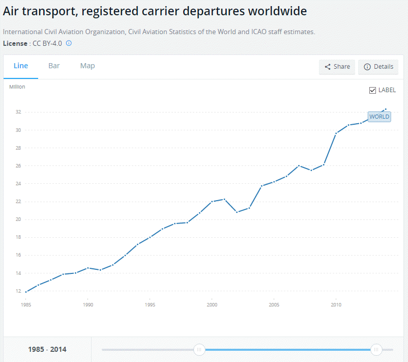

```{r setup, include=FALSE}
knitr::opts_chunk$set(echo = TRUE, warning = FALSE, fig.width = 16,
                      fig.height = 9,fig.align = "left")
```

# Index

* [Intro](#intro)
* [Setup](#Setup)
* [Read In Data](#Read-In-Data)
* [Preliminary investigation](#Preliminary-investigation)
* [Question generation](#Question-generation)
* [Investigation](#Investigation)
* [Putting all together](#Putting-all-together)
* [Final output](#Final-output)

#Intro

FiveThirtyEight is a great website and they perform many data driven analyses. 
They release a lot of the data they use on their GitHub account and repackage them into a nice R package.
Leveraging upon it, I am reanalyzing some datasets - today I'll give a go at the **airline_safety** one, a simple database including the amount of births per day in the US between 1994 and 2003.

#Setup

Let's start loading the library


```{r lib}
library(fivethirtyeight)
```

# Read In Data

I'm then loading the dataset chosen into a dataframe:

```{r get_data}
df<-airline_safety
```

# Preliminary investigation

This time, I'm going to use the *funModeling* package to have a first peek into the data.

``` {r preliminary1}
dim(df)
class(df)
suppressMessages(library(funModeling))
df_status(df)
```

We have an object of type *`r class(df)`*, meaning it is a tibble dataframe, with 56 rows and 9 variables, 7 of whom are numeric, one is logical and the remaining one is of character type.
The dataset provided by FiveThirtyEight is tidy, there are no *NA* or *NaN* values and each airline is listed uniquely.

Plotting histograms of the seven numerical variables helps getting a first feeling about them.

``` {r preliminary2}
plot_num(df)
```

You can notice straight away that many more airlines in the 2000-2014 period had no fatal accidents at all compared to what happened in the 1985-1999 timespan.

Variables are profiled to get few standard statistical values.

``` {r preliminary3}
profiling_num(df)
```

In this case, I find far more helpful the visual clues I got from the histograms.

I'm quickly checking the correlation among numerical variables, using the *corrplot* package.

``` {r preliminary4}
suppressMessages(library(corrplot))
corrplot(cor(df[,3:9]),method = "circle")
```
It's interesting to see how incidents and fatal accidents are strongly correlated.

I am having more than few doubts about the *avail_seat_km_per_week* data.
Available Seat Kilometers per week captures the weekly total flight passenger capacity of an airline in kilometers: it is obtained by multiplying the total number of seats available for scheduled passengers and the total number of kilometers in which those seats were flown. 
So airlines with larger planes (think Boeing 747 for the period) flying longer (i.e. transatlantic) routes will have more available seat kilometers per week but far less flights than airlines flying short inter-European routes with smaller aircraft (think Airbus A320).
Furthermore during the 1985-2014 period I guess the figure changed dramatically and here we get just a single value (average over the period?). 




How meaningful is that? 

Nate Silver in [his analysis](https://fivethirtyeight.com/features/should-travelers-avoid-flying-airlines-that-have-had-crashes-in-the-past/) rebalanced all incidents and accidents based on the available seat kilometers flown every week by each airline: I'm not sure, really not sure it makes sense. 

If I had to choose how to normalize the number of incidents & accidents, I would have probably gone for the number of flights flown in the given period by each airline or maybe by the flight hours - let's see if such data are available somewhere, at the time being I'm able to find only [data for the EU](http://appsso.eurostat.ec.europa.eu/nui/submitViewTableAction.do) on the lovely EUROSTAT website and for US Airlines in the FAA website.

# Question generation

Having had a glimpse at the data, I can start formulating questions to investigate, like:

1. Which airline got more incidents / accidents?
2. Which airlines suffered more casualties?
3. Are there any trend in how safe airlines are?

# Data wrangling

Data is provided for two separate periods of time 1985-1999 and 2000-2014: I'll investigate each period separately and compare the data but I want to have a look even at the total values for the complete 1985-2014 timespan.
To facilitate these operations, I change the data from the current wide format (i.e. one column for each variable) to a long format (a single column for defining the type of variable and one for its value):

```{r data_wrangling}
suppressMessages(library(dplyr))
suppressMessages(library(tidyr))                 

df<-df%>%gather(type,amount,incl_reg_subsidiaries:fatalities_00_14)

```

# Investigation

###1. Which airline got more incidents / accidents?
```{r counts_1}
library(ggplot2)


ggplot(data=df%>%filter(!(type%in%c("incl_reg_subsidiaries",
                                    "avail_seat_km_per_week",
                                    "fatalities_85_99",
                                    "fatalities_00_14"))))+
  geom_col(position = position_stack(reverse = TRUE),
           aes(x=factor(airline,levels = rev(levels(as.factor(airline)))),
               y=amount,
               fill=factor(type)))+
  coord_flip()

```

Pretty chaotic, too chaotic I'd say.
Let's try reordering the airlines per amount of incidents/accidents

```{r counts_2}
ggplot(data=df%>%filter(!(type%in%c("incl_reg_subsidiaries",
                                    "avail_seat_km_per_week",
                                    "fatalities_85_99",
                                    "fatalities_00_14"))))+
  geom_col(position = position_stack(reverse = TRUE),
           aes(x=reorder(airline,amount),
               y=amount,
               fill=factor(type)))+
  coord_flip()+ 
theme(strip.background = element_blank(),strip.text.x = element_blank())
```

Better, but still not clear enough I'd say.
Let's try faceting the data to split incidents & accidents.
```{r counts_3}
ggplot(data=df%>%filter(!(type%in%c("incl_reg_subsidiaries",
                                    "avail_seat_km_per_week",
                                    "fatalities_85_99",
                                    "fatalities_00_14"))))+
  geom_col(position = position_stack(reverse = TRUE),
           aes(x=reorder(airline,amount),
               y=amount,
               fill=factor(type)))+
  coord_flip()+facet_wrap(~ifelse((type%in%c("incidents_00_14","incidents_85_99")), "Incidents", "Fatal Accidents"))
```
Flying with Aeroflot? No thanks. Flying TAP? Oh yes!
There are a bunch of airlines that never had fatal accidents: 
even if past performance does not predict future one I'd happily settle with any of them.

Clearly not taking into account very important variables (i.e. the amount of flights carried out, the flying hours of the aircraft, their type and maintainance status, weather conditions) consistently lowers the reliability of the analysis: here we are just looking at accidents and incidents.

What if we include the time dimension into our analysis?

```{r counts_4}
ggplot(data=df%>%filter(!(type%in%c("incl_reg_subsidiaries",
                                    "avail_seat_km_per_week",
                                    "fatalities_85_99",
                                    "fatalities_00_14"))))+
  geom_col(position = position_stack(reverse = TRUE),
           aes(x=reorder(airline,amount),
               y=amount,
               fill=factor(type)))+
  coord_flip()+facet_grid(ifelse((type%in%c("incidents_00_14","fatal_accidents_00_14")), "2000-2014", "1985-1999")~ifelse((type%in%c("incidents_00_14","incidents_85_99")), "Incidents", "Fatal Accidents"))
```

Here you can easily see that 

* Aeroflot was a far more dangerous airline in the 1985-1999 period than in the 2000-2014 one.
* Generally speaking, both the number of fatal accidents and incidents dropped sharply in the latest period, with incident rates falling almost by half and fatal accidents by more than two thirds.

```{r sum_data}
sum_data<-df%>%filter((type%in%c("fatal_accidents_85_99","fatal_accidents_00_14","incidents_85_99","incidents_00_14")))%>%group_by(type)%>%summarise(tot=sum(amount))%>%arrange(.,desc(type))

knitr::kable(data.frame(matrix(as.data.frame(sum_data)[,2], nrow = 2, ncol = 2, dimnames = list(c("1985-1999","2000-2014"),c("Incidents","Fatal-Accidents")))),caption="Total evolution of incidents and fatal accidents")
```

In any case, as a passenger I definitely do not want to be on a flight suffering a fatal accident, irrespective of the number of fatalities. It should not be enjoyable, but I could bear suffering an incident. 

Translating these feelings into data, I could create a composite safety index, in which incidents and accidents are summed up together applying a reduction weight (5%) to the former. 

I am definying a safety factor for each airline as: 

```safety_factor = fatal_accidents_85_99+fatal_accidents_00_14+0.05*(incidents_00_14+incidents_85_99)```

and then rebasing it so the max value of 1 is achieved for the most dangerous airline.

The resulting graph would be the following in which safer airlines are listed at the bottom and most dangerous at the top:

```{r factor}
ggplot(data=(df%>%
           mutate(factor=
                      ifelse(type%in%c("incidents_00_14","incidents_85_99"),
                             amount*.05,
                             ifelse(type%in%c("fatal_accidents_85_99","fatal_accidents_00_14"),
                                    amount,
                                    0)))%>%
           group_by(airline)%>%
           summarise(safety_factor=sum(factor))%>%
             mutate(safety_factor=safety_factor/max(safety_factor))%>%
           arrange(.,desc(safety_factor))))+
    geom_col(position = position_stack(reverse = TRUE),
             aes(x=reorder(airline,safety_factor),
                 y=safety_factor))+
    coord_flip()
  
```


What about considering a discounting factor (25%) on the period in which accidents / incidents happened?

Let's redefine the safety factor as:

```safety_factor_2 = 0.25*fatal_accidents_85_99+fatal_accidents_00_14+0.05*(incidents_00_14+0.25*incidents_85_99)```

Once more rebasing it so the max value of 1 is achieved for the most dangerous airline.

```{r factor2}
ggplot(data=(df%>%
           mutate(factor=
                      ifelse(type%in%c("incidents_00_14","incidents_85_99"),
                             amount*.05,
                             ifelse(type%in%c("fatal_accidents_85_99","fatal_accidents_00_14"),
                                    amount,
                                    0)))%>%mutate(factor=
                      ifelse(type%in%c("fatal_accidents_85_99","incidents_85_99"),
                             factor*.25,factor))%>%
           group_by(airline)%>%
           summarise(safety_factor=sum(factor))%>%
             mutate(safety_factor=safety_factor/max(safety_factor))%>%
           arrange(.,desc(safety_factor))))+
    geom_col(position = position_stack(reverse = TRUE),
             aes(x=reorder(airline,safety_factor),
                 y=safety_factor))+
    coord_flip()
  
```

Clearly I set up the weights and you can *play* with them to shift some airlines across the ranking: the approach is definitely not robust, consider it indicative at best.

###2. Which airlines suffered more casualties?

Thanks God not all fatal accidents are fatal for all passengers / crew members.
Anyway I'd just prefer **NOT** to be on such flights.

Let's have a look at how many fatalities we got per airline.

```{r dead_1}

ggplot(data=df%>%filter((type%in%c("fatalities_85_99",
                                    "fatalities_00_14"))))+
  geom_col(position = position_stack(reverse = TRUE),
           aes(x=reorder(airline,amount),
               y=amount,
               fill=factor(type)))+
  coord_flip()

```

Interesting that the airlines with more fatal accidents are not those with more fatalities. 
Here I am going to check the average number of fatalities per accident.

```{r dead_2}

ggplot(data=data_frame(airline=df$airline[1:112],
                       fatality_ratio=ifelse(is.na((df$amount[df$type%in%c("fatalities_00_14",
                                                              "fatalities_85_99")]/
                                         df$amount[df$type%in%
                                                     c("fatal_accidents_00_14",
                                                       "fatal_accidents_85_99")])),
                                         0,
                                         (df$amount[df$type%in%c("fatalities_00_14",
                                                              "fatalities_85_99")]/
                                         df$amount[df$type%in%
                                                     c("fatal_accidents_00_14",
                                                       "fatal_accidents_85_99")]))))+
  geom_col(position = position_stack(reverse = TRUE),
           aes(x=reorder(airline,fatality_ratio),
               y=fatality_ratio))+
  coord_flip()

```

Clearly without contextualizing each accident (i.e. number of people onboard in each accident, aircraft capacity) it is practically impossible to derive any conclusion from this graph.
Looking at it you could start thinking that Japan Airlines has not such a safe record after all. 
Probably if you combine this info with the number of fatal accidents Japan Airlines had (1 in the 1985-2014 timespan), 
another perception appears in your mind.
It's really up to the data analyst to set up the ground for a sound discussion based on hard and reliable evidence.

*PS*: here the [Wikipedia](https://en.wikipedia.org/wiki/List_of_Japan_Airlines_incidents_and_accidents#1980s) 
extract about Japan Airlines lone accident

> On August 12, 1985, Japan Airlines Flight 123 operated by a Boeing 747SR (the same aircraft aforementioned involved in a tailstrike incident) bound for Osaka, lost all its hydraulic flight control systems shortly after takeoff from Tokyo International Airport and, after attempting to limp back to Tokyo, crashed into Mount Takamagahara near Gunma Prefecture. It was the deadliest single-aircraft disaster in history (and the third deadliest air disaster in history, after the Tenerife airport disaster and the September 11 attacks); 520 out of 524 people on board died, including the famous singer Kyu Sakamoto.


###3. Are there any trend in how safe airlines are?

Speaking very generally, considering that the number of flights has definitely increased over the past 30+ years while the number of incidents & fatal accidents has dropped very consistently, we can infer that it is far safer to fly now than in the '80s.

Anyway, without getting additional specific data like the number of flights, the routes flown and the number of passengers on board in each flight it is not possible to derive clear results on how safe(r) a specific airline is.

# Putting all together

Key take aways from the analysis performed using only the dataset provided are:

1. the number of incidents & accidents dropped sharply in the most recent period considered
2. how safer an airline is compared to another can just be guessed, not confirmed by the data available
3. thankfully the number of fatalities and the number of accidents do not go hand on hand - it is far more common to have a limited number of fatalities than to all people on an aircraft wiped out.

# Final output

I decided to focus on the number of accidents & incidents providing a splitted view between the two categories at total and at airline level.

```{r graph_accident_incident_trend_total}
ggplot(data=df%>%filter(!(type%in%c("incl_reg_subsidiaries",
                                    "avail_seat_km_per_week",
                                    "fatalities_85_99",
                                    "fatalities_00_14")))%>%
         mutate(class=ifelse((type%in%
                                     c("incidents_00_14","incidents_85_99")), 
                                  "Incidents", "Fatal Accidents"))%>%
         mutate(period=ifelse((type%in%
                                     c("incidents_00_14","fatal_accidents_00_14")), 
                                  "2000-2014", "1985-1999"))%>%
         group_by(type,class,period)%>%
         summarise(n_events=sum(amount)))+
  geom_col(position = "dodge",
           aes(x=period,
               y=n_events,
               fill=factor(period,levels = rev(levels(as.factor(period))))))+
facet_grid(class~.,scales = "free")+
  labs(fill='Period',
       x="Period",
       y="Number of events",
       title="Total Major events in the 1984-2014 period")+
  theme(plot.title = element_text(size=25),
        plot.subtitle = element_text(size=20),
        axis.title = element_text(size=20),
        axis.text = element_text(size=15),
        legend.title = element_text(size=18),
        legend.text = element_text(size=15),
        legend.position = "none",
        strip.text.y = element_text(size = 18, face="bold"))+
  scale_fill_manual(values = c("cornflowerblue","antiquewhite4"))

```


```{r graph_accident_incident_trend_airline, fig.height = 16}
ggplot(data=df%>%filter(!(type%in%c("incl_reg_subsidiaries",
                                    "avail_seat_km_per_week",
                                    "fatalities_85_99",
                                    "fatalities_00_14")))%>%
         mutate(class=ifelse((type%in%
                                     c("incidents_00_14","incidents_85_99")), 
                                  "Incidents", "Fatal Accidents"))%>%
         mutate(period=ifelse((type%in%
                                     c("incidents_00_14","fatal_accidents_00_14")), 
                                  "2000-2014", "1985-1999")))+
  geom_col(position = "dodge",
           aes(x=rep(reorder(airline[class=="Fatal Accidents"],amount[class=="Fatal Accidents"]+.001*amount[class=="Incidents"]),2),
               y=amount,
               fill=factor(period,levels = rev(levels(as.factor(period))))))+
  coord_flip()+facet_wrap(~class)+
  labs(fill='Period',
       x="Airlines",
       y="Amount of events",
       title="Major events by airline in the 1984-2014 period",
       subtitle="Sorted by total amount of fatal accidents and then by incidents")+
  theme(plot.title = element_text(size=25),
        plot.subtitle = element_text(size=20),
        axis.title = element_text(size=20),
        axis.text = element_text(size=15),
        legend.title = element_text(size=18),
        legend.text = element_text(size=15),
        legend.position = c(.9,.075),
        strip.text.x = element_text(size = 18, face="bold"))+
  scale_fill_manual(values = c("cornflowerblue","antiquewhite4"))+
  geom_text(data = data.frame( x = 6,
                              y = 50,
                       class = factor("Fatal Accidents",
                                      levels =c("Incidents", "Fatal Accidents"))),
            label = "Safer",
            size=12, 
            color="green4", 
            aes(x,y,label=label), 
            inherit.aes=FALSE)+
  geom_text(data = data.frame( x = 53,
                              y = 50,
                       class = factor("Fatal Accidents",
                                      levels =c("Incidents", "Fatal Accidents"))),
            label = "More Dangerous",
            size=12, 
            color="darkred", 
            aes(x,y,label=label), 
            inherit.aes=FALSE)

```

