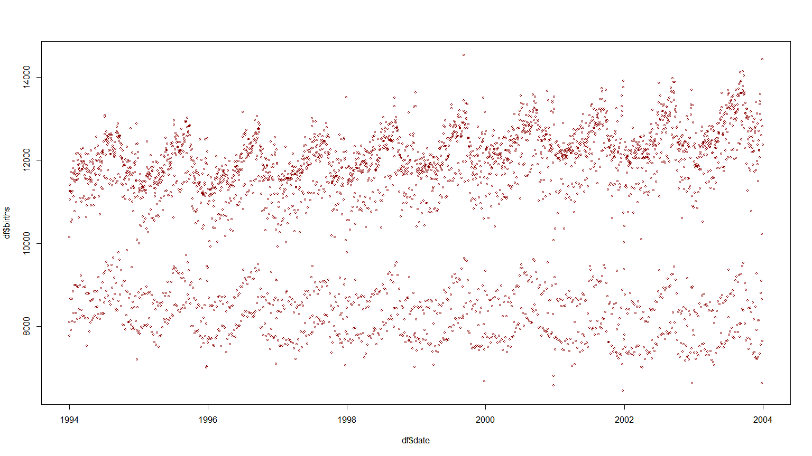
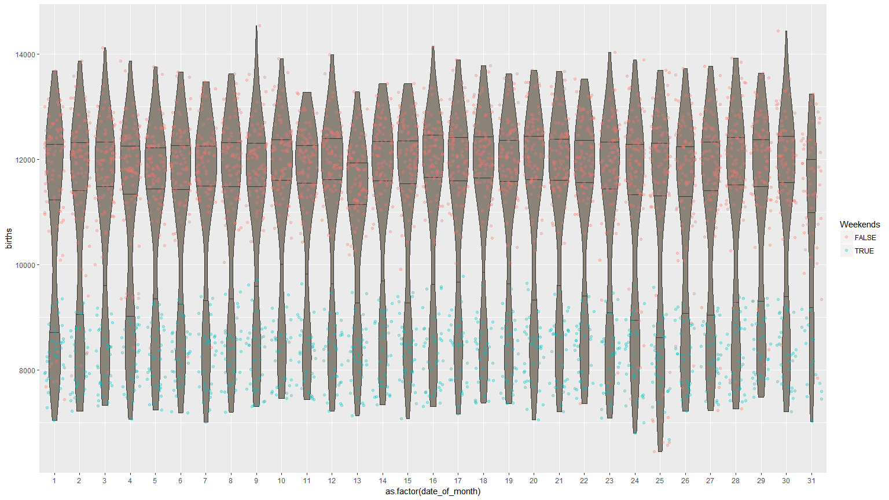
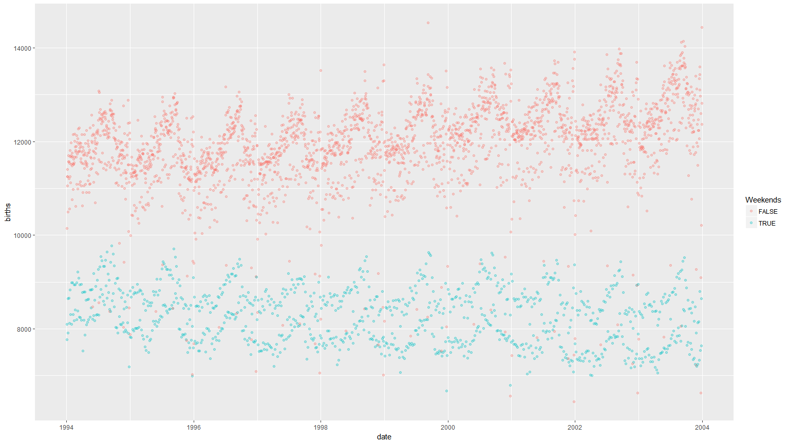

# Index

* [Intro](#intro)
* [Setup](#Setup)
* [Read In Data](#Read-In-Data)
* [Preliminary investigation](#Preliminary-investigation)
* [Question generation](#Question-generation)
* [Investigation](#Investigation)
* [Putting all together](#Putting-all-together)
* [Final output](#Final-output)

#Intro

FiveThirtyEight is a great website and they perform many data driven analyses. 
They release a lot of the data they use on their GitHub account and repackage them into a nice R package.
Leveraging upon it, I am reanalyzing some datasets - today I'll give a go at the **US_births_1994_2003** one, a simple database including the amount of births per day in the US between 1994 and 2003.

#Setup

Let's start loading the library


```r
library(fivethirtyeight)
```

# Read In Data

I'm then loading the dataset chosen into a dataframe:


```r
df<-US_births_1994_2003
```

# Preliminary investigation

Let's look at what we got:


```r
str(df)
```

```
## Classes 'tbl_df', 'tbl' and 'data.frame':	3652 obs. of  6 variables:
##  $ year         : int  1994 1994 1994 1994 1994 1994 1994 1994 1994 1994 ...
##  $ month        : int  1 1 1 1 1 1 1 1 1 1 ...
##  $ date_of_month: int  1 2 3 4 5 6 7 8 9 10 ...
##  $ date         : Date, format: "1994-01-01" "1994-01-02" ...
##  $ day_of_week  : Ord.factor w/ 7 levels "Sun"<"Mon"<"Tues"<..: 7 1 2 3 4 5 6 7 1 2 ...
##  $ births       : int  8096 7772 10142 11248 11053 11406 11251 8653 7910 10498 ...
```

So we have an object of type *tbl_df, tbl, data.frame*, meaning it is a tibble dataframe.

It contains 3652 observations of 6 variables: year, month, date_of_month, date, day_of_week, births.
5 variables are used to provide different info in different formats about the date and the remaining one is the sum of births on that date as an integer.

Honestly the dataset could be trimmed down to only 2 variables (date, births) without losing information but very probably at least some of the other variables would then needed to be recreated at a later stage for analysis purposes.

Using the *dplyr* package, similar insights into the dataset could be obtained using the `glimpse()` command like this:


```r
library(dplyr,warn.conflicts = FALSE)
glimpse(df)
```

```
## Observations: 3,652
## Variables: 6
## $ year          <int> 1994, 1994, 1994, 1994, 1994, 1994, 1994, 1994, ...
## $ month         <int> 1, 1, 1, 1, 1, 1, 1, 1, 1, 1, 1, 1, 1, 1, 1, 1, ...
## $ date_of_month <int> 1, 2, 3, 4, 5, 6, 7, 8, 9, 10, 11, 12, 13, 14, 1...
## $ date          <date> 1994-01-01, 1994-01-02, 1994-01-03, 1994-01-04,...
## $ day_of_week   <ord> Sat, Sun, Mon, Tues, Wed, Thurs, Fri, Sat, Sun, ...
## $ births        <int> 8096, 7772, 10142, 11248, 11053, 11406, 11251, 8...
```

To get a better feeling of the data, I have a look at the first and last 10 observations:


```r
head(df,10)
```

```
## # A tibble: 10 x 6
##     year month date_of_month date       day_of_week births
##    <int> <int>         <int> <date>     <ord>        <int>
##  1  1994     1             1 1994-01-01 Sat           8096
##  2  1994     1             2 1994-01-02 Sun           7772
##  3  1994     1             3 1994-01-03 Mon          10142
##  4  1994     1             4 1994-01-04 Tues         11248
##  5  1994     1             5 1994-01-05 Wed          11053
##  6  1994     1             6 1994-01-06 Thurs        11406
##  7  1994     1             7 1994-01-07 Fri          11251
##  8  1994     1             8 1994-01-08 Sat           8653
##  9  1994     1             9 1994-01-09 Sun           7910
## 10  1994     1            10 1994-01-10 Mon          10498
```

```r
tail(df,10)
```

```
## # A tibble: 10 x 6
##     year month date_of_month date       day_of_week births
##    <int> <int>         <int> <date>     <ord>        <int>
##  1  2003    12            22 2003-12-22 Mon          12967
##  2  2003    12            23 2003-12-23 Tues         12598
##  3  2003    12            24 2003-12-24 Wed           9096
##  4  2003    12            25 2003-12-25 Thurs         6628
##  5  2003    12            26 2003-12-26 Fri          10218
##  6  2003    12            27 2003-12-27 Sat           8646
##  7  2003    12            28 2003-12-28 Sun           7645
##  8  2003    12            29 2003-12-29 Mon          12823
##  9  2003    12            30 2003-12-30 Tues         14438
## 10  2003    12            31 2003-12-31 Wed          12374
```

and get some statistics:


```r
summary(df)
```

```
##       year          month        date_of_month        date           
##  Min.   :1994   Min.   : 1.000   Min.   : 1.00   Min.   :1994-01-01  
##  1st Qu.:1996   1st Qu.: 4.000   1st Qu.: 8.00   1st Qu.:1996-07-01  
##  Median :1998   Median : 7.000   Median :16.00   Median :1998-12-31  
##  Mean   :1998   Mean   : 6.524   Mean   :15.73   Mean   :1998-12-31  
##  3rd Qu.:2001   3rd Qu.:10.000   3rd Qu.:23.00   3rd Qu.:2001-07-01  
##  Max.   :2003   Max.   :12.000   Max.   :31.00   Max.   :2003-12-31  
##                                                                      
##  day_of_week     births     
##  Sun  :522   Min.   : 6443  
##  Mon  :522   1st Qu.: 8844  
##  Tues :522   Median :11615  
##  Wed  :522   Mean   :10877  
##  Thurs:521   3rd Qu.:12274  
##  Fri  :521   Max.   :14540  
##  Sat  :522
```

So we have a complete dataset, no `NA` values and every day in the interval 1994-01-01 - 2003-12-31 is captured.

Let's have a first, very basic look at the data:


```r
plot(df$date,df$births,type="p",col="darkred",cex=.5,lwd=1)
```



Mmm, it seems data can be grouped in 2: days with about 8000+ births and days with 12000+, with a clear gap at about 10000 births. 
We'll see if this first insight will be confirmed later on by more in depth analyses but a basic instograms provides already good info.


```r
hist(df$births)
```


**PS**: as till publication I'm the only one looking at the graphs and trying to make sense of them, I'm not really putting a lot of effort in making them nice(r) and more readable - proper formatting and labelling will be done for the final graph(s) only.

**PPS**: there are packages, like *dataMaid*, that automates these initial checks: I prefer to call the individual functions and build up my understanding of the data but you could prefer to just have a look at the results in one go as presented by *dataMaid*.

# Question generation

Having had a glimpse at the data, I can start formulating questions to investigate, like:

1. When did we get a peak in births? When a throu?
2. What is, if any, the specific day / week / month / day of the week in which people are coming to the world more often?
3. What is, if any, the most frequent time to get pregnant?
4. Is there any pattern behind the clustering around 8000+ births per day and the clustering around 12000+ births per day?

# Investigation

###1. When did we get a peak in births? When a throu?
Ok, to answer the first question above is pretty straightforward if not trivial, the first output below being the date with the highest number of births and the second the one with the lowest: 

```r
df%>%filter(births==max(births))%>%select(day_of_week, date)
```

```
## # A tibble: 1 x 2
##   day_of_week date      
##   <ord>       <date>    
## 1 Thurs       1999-09-09
```

```r
df%>%filter(births==min(births))%>%select(day_of_week, date)
```

```
## # A tibble: 1 x 2
##   day_of_week date      
##   <ord>       <date>    
## 1 Tues        2001-12-25
```

Well, I'm not surprised the lowest number of births is on a Xmas day: both patients and doctors try to anticipate or posticipate the birth if feasible ;).

###2. What is, if any, the specific day / week / month / day of the week in which people are coming to the world more often?

Let's take a graphical approach on this, putting aside for a moment the statistical relevance of the findings.
Even if base plotting capabilities are great in R, I often find easier and more pleasant to work with the *ggplot2* package - let's launch it:


```r
library(ggplot2)
```


* #### Day of the week
In base R, I'm then plotting the day of the week versus the births

```r
plot(df$day_of_week,df$births)
```


and then doing the same in *ggplot2* using a violin plot

```r
ggplot(df,aes(x=day_of_week,y=births))+
  geom_violin(scale="count",
              fill="antiquewhite4",
              draw_quantiles = c(0.25, 0.5, 0.75))+
  geom_jitter(aes(color=as.factor(month)),alpha=0.3)+
  labs(color='Months')
```


There are clearly less births on the weekends than on the workdays: is that because hospitals tend to have less personnel over the weekends and plan all operations during the weekdays? It could be, but with the data at hand it cannot be checked.

Btw, I displayed and color coded the points in the plot above to get a feeling about their distribution per calendar month: data seems pretty much scattered, so really nothing to deduct straight away.

* #### Day

Let's reuse the code from the previous ggplot (yes, best practice would be to create a function but I tend to tinker a lot with each individual graphs so I prefer to repeat the code).

```r
ggplot(df,aes(x=as.factor(date_of_month),y=births))+
  geom_violin(scale="count",
              fill="antiquewhite4",
              draw_quantiles = c(0.25, 0.5, 0.75))+
  geom_jitter(aes(color=as.factor(day_of_week %in% c("Sun","Sat"))),alpha=0.3)+
  labs(color='Weekends')
```



This time instead of color coding the jittered points with the month, I opted to capture and highlight the difference between workdays and weekends as in the previous graph we already saw their effect.

Ah, if you are asking yourself why the x aestetics was factorized, well, it has to do with how geom_violin works: if the integer values were kept, the following general graph would be obtained


```r
ggplot(df,aes(x=(date_of_month),y=births))+
  geom_violin(scale="count",
              fill="antiquewhite4",
              draw_quantiles = c(0.25, 0.5, 0.75))+
  geom_jitter(aes(color=as.factor(day_of_week %in% c("Sun","Sat"))),alpha=0.3)+
  labs(color='Weekends')
```


practically the frequency would have been calculated on the complete dataset, without differentiating the various dates of the month.

* #### Week
To get to the week, I use the `week` function in the *lubridate* package.

```r
library(lubridate,warn.conflicts = FALSE)
ggplot(df,aes(x=as.factor(week(date)),y=births))+
  geom_violin(scale="count",
              fill="antiquewhite4",
              draw_quantiles = c(0.25, 0.5, 0.75))+
  geom_jitter(aes(color=as.factor(year)),alpha=0.3)+
  labs(color='Year')
```


It seems there is trend there - let's have a better look dropping the violins and adding trend lines for weekdays and weekends. 


```r
ggplot(df,aes(x=as.factor(week(date)),y=births))+
  geom_jitter(aes(color=as.factor(year)),alpha=0.3)+
  labs(color='Year')+ geom_smooth(show.legend = FALSE, color="antiquewhite4", method=loess, se=FALSE,aes(alpha=1,group=as.factor(day_of_week %in% c("Sun","Sat"))))
```


Now the peak in weeks 32/36 is better visible as well as the drop towards end of the year. 
Do you see the spike in week 52? My guess is that docs are hell bent to avoid births on the 31st of Dec / 1st of Jan and hence try to anticipate births: just a guess, the data at hand does not really allow any proper investigation.

* #### Month
As months are just aggregation of weeks, I'd expect to see the same trend as in the above section, just aggregated.

```r
ggplot(df,aes(x=as.factor(month),y=births))+
  geom_jitter(aes(color=as.factor(year)),alpha=0.3)+
  labs(color='Year')+ geom_smooth(show.legend = FALSE, color="antiquewhite4", method=loess, se=FALSE,aes(alpha=1,group=as.factor(day_of_week %in% c("Sun","Sat"))))
```


* #### Year

So far we were not able to spot any difference and any trend based on years. 
Let's now specifically investigate it considering trends for overall births as well as for borths on weekends and weekdays:

```r
ggplot(df,aes(x=year,y=births))+
  geom_jitter(aes(color=as.factor(month)),alpha=0.3)+
  labs(color='Month')+ 
  geom_smooth(show.legend = FALSE, color="antiquewhite4", method=loess, 
              se=FALSE,
              aes(alpha=1,group=as.factor(day_of_week %in% c("Sun","Sat"))))+ 
  geom_smooth(show.legend = FALSE, color="darkred", method=loess, 
              se=FALSE,aes(alpha=1))
```


So there is a slight upwards trend for overall births resulting from the combination of a downward trends for births on weekends and an upward trend for births on the weekdays.

###3. What is, if any, the most frequent time to get pregnant?

Typical pregnancy is 40 weeks or `7*40` days: substituting this amount from the *date* in the dataset we get the indicative date of conception. 
Compared to the plots shown so far, we have a mere shift of the x axis

```r
ggplot(df,aes(x=as.factor(month(date-(7*40))),y=births))+
  geom_jitter(aes(color=as.factor(day_of_week %in% c("Sun","Sat"))),alpha=0.3)+
  labs(color='Weekends')
```


More babies are conceived during the cold months with a peak in December.
Do more festivities, more free time, worde weather lead to more kids? It could be, but with the data at hand cannot be checked.

###4. Is there any pattern behind the clustering around 8000+ births per day and the clustering around 12000+ births per day?

Heck, yes and we showed it in many graphs already.

```r
ggplot(df,aes(x=date,y=births))+
  geom_jitter(aes(color=as.factor(day_of_week %in% c("Sun","Sat"))),alpha=0.3)+
  labs(color='Weekends')
```



The number of births greatly differs between weekdays and weekends.

# Putting all together

From the analysis performed we got 3 major insights:
1. there is a consistent difference between births on weekdays and weekends
2. overall, the number of births is slightly increasing
3. births peak in August

Let's try to visualize these points in few graphs.

# Final output

If I had to present insights from the US 1994-2003 datasets I'd talk the audience through the following 2 graphs, using the simpler first one to discuss trends and groups of data while the more crowded second plot to tackle aggregated values.
### Births trends and groups


```r
ggplot(df,aes(x=date,y=births))+
  geom_jitter(aes(color=as.factor(day_of_week %in% c("Sun","Sat"))),alpha=0.3)+
  labs(color='Groups',y="Births",x="Date",title="Births in the US in 1994-2003",
       subtitle="Groupings & Trends")+ 
  geom_smooth(show.legend = FALSE, color="darkred", method=loess, 
              se=FALSE,data=df[!df$day_of_week %in% c("Sun","Sat"),],
              aes(alpha=1))+ 
  geom_smooth(show.legend = FALSE, color="antiquewhite4", method=loess, 
              se=FALSE,aes(alpha=1))+ 
  geom_smooth(show.legend = FALSE, color="navy", method=loess, 
              se=FALSE,data=df[df$day_of_week %in% c("Sun","Sat"),],
              aes(alpha=1))+
  theme(plot.title = element_text(size=25),
        plot.subtitle = element_text(size=20),
        axis.title = element_text(size=20),
        axis.text = element_text(size=15),
        legend.position = c(0.075, 0.9))+
  annotate("text", x=as.Date("2004-01-01"), y=11000, 
           label= "Overall",color="antiquewhite4",size=8)+
  annotate("text", x=as.Date("1994-04-01"), y=8800, 
           label= "Weekends",color="navy",size=8)+
  annotate("text", x=as.Date("1994-04-01"), y=12000, 
           label= "Weekdays",color="darkred",size=8)+
  scale_color_manual(labels = c("Weekdays", "Weekends"), 
                     values = c("lightcoral", "dodgerblue"))
```


### Monthly view

```r
ggplot(df%>%group_by(year,month)%>%summarise(Births=sum(births)),
       aes(x=as.factor(month),y=(Births)))+
  geom_line(aes(group=year,color=as.factor(year)))+
  geom_point(aes(color=as.factor(year)),alpha=0.3)+
  labs(color='Years',y="Total births per month",
       x="Month",title="Births in the US in 1994-2003",
       subtitle="Monthly combined values")+
  theme(plot.title = element_text(size=25),
        plot.subtitle = element_text(size=20),
        axis.title = element_text(size=20),
        axis.text = element_text(size=15),
        legend.position = "bottom")
```


